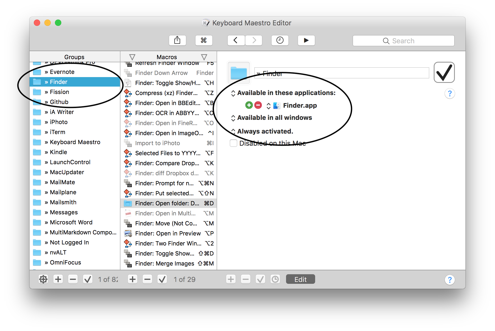
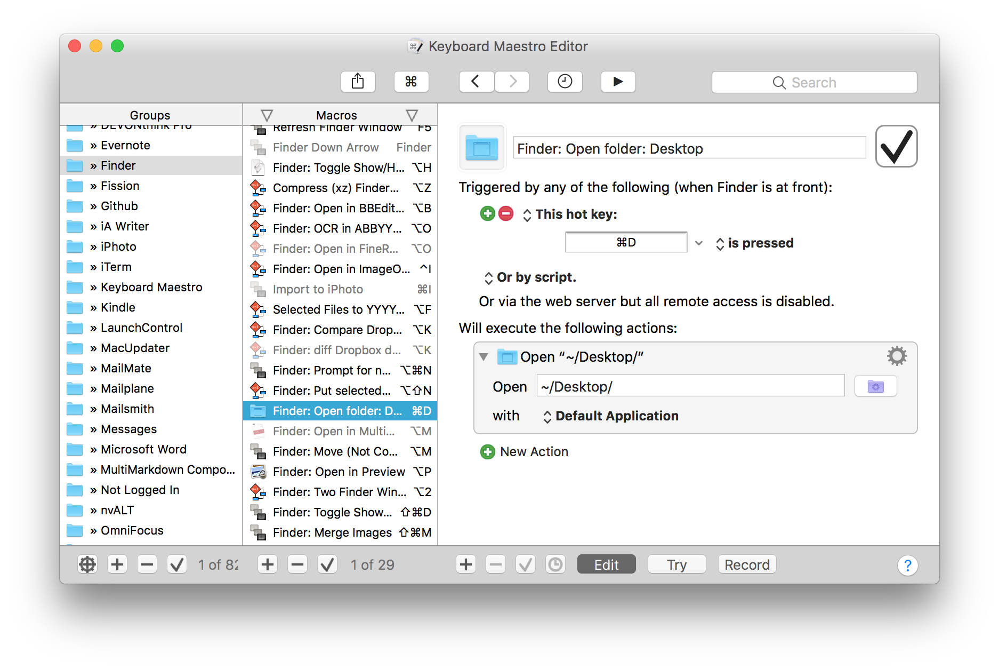

<blockquote class="twitter-tweet" data-lang="en">
Thing I do a lot:  Accidentally duplicate one or more files by hitting ⌘-D in the Finder, expecting it to take me to the Desktop folder, like it does in Open/Save panels.
&mdash; Greg Pierce (@agiletortoise) <a href="https://twitter.com/agiletortoise/status/1041729096340971520?ref_src=twsrc%5Etfw">September 17, 2018</a></blockquote>

<blockquote class="twitter-tweet" data-lang="en">
Me too! I actually made a <a href="https://twitter.com/keyboardmaestro?ref_src=twsrc%5Etfw">@keyboardmaestro</a> shortcut for Finder that opens the Desktop with ⌘D because I personally never use ⌘D for duplicating files.
&mdash; TJ Luoma (@tjluoma) <a href="https://twitter.com/tjluoma/status/1041765429180620801?ref_src=twsrc%5Etfw">September 17, 2018</a></blockquote>

<blockquote class="twitter-tweet" data-lang="en">
Do you delete the standard shortcut in Finder? Possible to share your solution?
&mdash; 🚩𝙲𝙻𝙰𝚄𝚂 𝚆𝙾𝙴𝙻𝙺𝙲𝙷𝙴𝙽 (@confluencepoint) <a href="https://twitter.com/confluencepoint/status/1041808897697296384?ref_src=twsrc%5Etfw">September 17, 2018</a></blockquote>

Here’s how I solved this:

### Step 1: Create a “Group” in Keyboard Maestro which is only active for Finder:

This allows me to define keyboard shortcuts, etc. that are only activated when I am using Finder.

### Step 2: Tell Keyboard Maestro to use ⌘D to Open the Desktop:

That’s all there is to it.

I didn’t delete the standard shortcut. Apparently Keyboard Maestro intercepts the ⌘D before Finder ever sees it.

[Keyboard Maestro]: http://www.keyboardmaestro.com/main/

It’s very simple, but if you want to use my Keyboard Maestro macro, you can [see it here](finder-cmd-d-for-desktop.kmmacros) or [right-click-save-as this link](https://raw.githubusercontent.com/tjluoma/keyboard-maestro/master/finder/cmd-d-for-desktop/finder-cmd-d-for-desktop.kmmacros) and then rename it from “finder-cmd-d-for-desktop.kmmacros.txt” to “finder-cmd-d-for-desktop.kmmacros” in order to import it into Keyboard Maestro.

